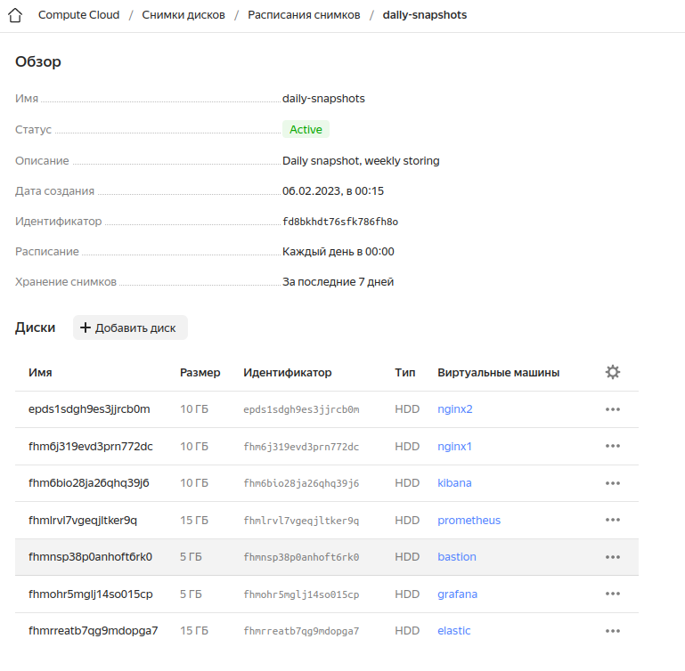

#  Дипломный проект по профессии "Системный администратор"
Содержание
==========
* [Инфраструктура](#Инфраструктура)
    * [Сайт](#Сайт)
    * [Мониторинг](#Мониторинг)
    * [Логи](#Логи)
    * [Сеть](#Сеть)
    * [Резервное копирование](#Резервное-копирование)
    * [Дополнительно](#Дополнительно)

---------

## Инфраструктура
Для развертывания инфраструктуры, использован Terraform. Для установки ПО и настройки, использован Ansible

Все файлы конфигурации размещены в [репозитории github](https://github.com/akhaliulin/diploma).

Для web-серверов использованы машины на CentOS 7, для всех остальных Ubuntu 22.04
В результате было создано и сконфигурировано 7 виртуальных машин ([Конфигурация terraform](https://github.com/akhaliulin/diploma/blob/master/terraform/instances.tf))

 
### Сайт

Согласно условиям задания, были созданы 2 виртуальные машины в разных зонах доступности, в качестве ОС, выбрана CentOS 7. Для установки и конфигурации nginx использовалась [ansible role](https://github.com/akhaliulin/diploma/tree/master/ansible/roles/nginx)

Созданы Target Group, Backend Group, HTTP router, Application load balancer ([Конфигурация terraform](https://github.com/akhaliulin/diploma/blob/master/terraform/balancer.tf))

### Мониторинг
Создано 2 ВМ, на которых, с помощью, ansible role были развёрнуты [Prometheus](https://github.com/akhaliulin/diploma/tree/master/ansible/roles/prometheus) и [Grafana](https://github.com/akhaliulin/diploma/tree/master/ansible/roles/grafana)
На ВМ с nginx установлены node exporter и nginx exporter.
Настроено взаимодействие Grafana с Prometheus, добавлены дашборды с отображением метрик.

- Grafana доступна по адресу: http://158.160.32.150:3000
- login: admin
- password: admin123

### Логи
Установлены elasticsearch и kibana. К nginx серверам установлен filebeat (установка и настройка filebeat выполнялась одной ролью вместе с экспортерами). Filebeat отправляют в elasticsearch access.log и error.log напрямую, без logstash.

Не совсем понятно почему на скриншотах такой перекос сообщений в пользу одного хоста, подозреваю особенности работы балансировщика, т.к. запросы делал с одного ip адреса.

- Kibana доступна по адресу: http://158.160.58.249:5601
 
### Сеть
Создана виртуальная частная сеть с двумя подсетями, для зон доступности ru-central1-a и ru-central1-b, соответственно ([Конфигурация terraform](https://github.com/akhaliulin/diploma/blob/master/terraform/network.tf)). 

Поскольку для работы ansible мне нужны были публичные адреса всех ВМ, сначала я запустил все ВМ с включенным NAT. После выполнения настроек, вручную отключил публичные адреса нужным машинам через консоль управления.

Созданы 7 Security group ([Конфигурация terraform](https://github.com/akhaliulin/diploma/blob/master/terraform/sec_groups.tf)):

- ssh - ingress разрешает доступ по ssh только локальной подсети; egress - разрешает любой исходящий трафик.
- webservers - ingress разрешает доступ к портам экспортеров (9100, 9113) из локальной подсети и к порту 80 из локальной подсети для доступа балансировщика.
- prometheus - ingress разрешает доступ к порту prometheus (9090) из локальной подсети.
- grafana - ingress разрешает доступ к порту grafana (3000) с любого адреса.
- elastic - ingress разрешает доступ к порту elasticsearch (9200) из локальной подсети.
- kibana - ingress разрешает доступ к порту kibana (5601) с любого адреса.
- bastion - ingress разрешает доступ по ssh c любого адреса; egress разрешает доступ по ssh в локальную подсеть.

Группа ssh назначена всем хостам, кроме bastion хоста. Остальные группы назначены соответствующим ВМ.

Создана ВМ, выполняющая роль bastion host. С этой машины можно попасть на любую машину, размещённую в локальной сети.
Машина сконфигурирована с помощью [ansible](https://github.com/akhaliulin/diploma/tree/master/ansible/roles/bastion). Для удобства, генерируется файл hosts, чтобы можно было подключаться по хостнейму.

Для проверки, на данный хост открыт доступ по паролю, на другие хосты можно подключаться с помощью ssh ключа, который скопирован на машину.
- Адрес: 130.193.36.35
- login: user
- password: 1234567890
### Резервное копирование
Вручную, через консоль управления, созданы снапшоты дисков каждой ВМ. Также, через консоль управления настроено созданием снапшотов по расписанию - каждый день, срок хранения - неделя

